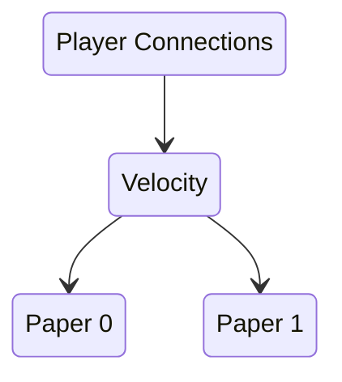

[Docker Compose](https://docs.docker.com/compose/) is a tool for defining and running multi-container applications.
In the context of Minecraft, it simplifies the setup for a multi-server network.

Using Docker Compose, it is possible to declaratively configure a full server network.
The configuration is a yaml file named `docker-compose.yaml` that can be used with the `docker-compose` command.
Place the configuration file in a directory and open this directory in a terminal.
Then, use the command `docker-compose up` to start the servers.

```shell
cd path/to/dir # Open working directory
nano docker-compose.yaml # Edit docker compose configuration
docker-compose up # Start servers
# ctrl-c to stop servers
```

Alternatively:

```shell
docker-compose up -d # Start servers in "detached mode" without attached log output
docker-compose down # Stop servers
```

For a full working example with Catalyst already set up,
you can check out the [Catalyst Example](https://github.com/anvilpowered/catalyst/tree/master/example).
By downloading the repository, building Catalyst and running `docker-compose up` in the `examples/docker-compose` directory,
you can start the servers.
Remember to restart the servers once before joining. See
the [README](https://github.com/anvilpowered/catalyst/tree/master/examples/docker-compose) for more information.

## Basic Compose Structure

Essentially, the Compose configuration file has approximately the following structure,
which tells Docker which servers to start and how to configure them.


<!-- @formatter:off -->
!!! note
    This is not a full working example;
    there is some additional configuration required to configure the paper servers to accept
    connections from the velocity proxy
<!-- @formatter:on -->

```yaml
services:
  # Velocity Proxy
  proxy:
    image: itzg/bungeecord:latest
    ports: # Expose ports to the host system
      - "25565:25565"
    environment:
      TYPE: VELOCITY

  # Paper 0
  paper-0:
    image: itzg/minecraft-server:latest
    expose: # Only expose ports within docker network and not externally
      - 25565
    environment:
      TYPE: PAPER
      VERSION: "1.20.6"
      EULA: true # By using this environment variable, you are indicating your acceptance of the Minecraft EULA
      ONLINE_MODE: false

  # Paper 1
  paper-1:
    image: itzg/minecraft-server:latest
    expose: # Only expose ports within docker network and not externally
      - 25565
    environment:
      TYPE: PAPER
      VERSION: "1.20.6"
      EULA: true # By using this environment variable, you are indicating your acceptance of the Minecraft EULA
      ONLINE_MODE: false
```

In this example, there are three services defined: one Velocity proxy and two Paper backend servers
using [itzg's](https://hub.docker.com/r/itzg/minecraft-server/) minecraft images.

<div style="text-align: center">



</div>

These images have *extensive* customization support and their own [docs](https://docker-minecraft-server.readthedocs.io/en/latest/) along
with a [discord server](https://discord.gg/DXfKpjB) for any questions related to the images themselves.
This page will only cover the details relevant for a Catalyst deployment.

## Adding config patches

To complete the basic setup, it is necessary to configure paper to accept connections from velocity.
Instead of manually editing `paper-global.yml`, we will use the
[patching system](https://docker-minecraft-server.readthedocs.io/en/latest/configuration/interpolating/#patching-existing-files)
to modify only the options that need to be modified.
This way, we can easily apply the settings to multiple servers
and have a good overview of which options have been changed from their default value.

A patch set is a set of declarative definitions that modify specific parts of a target file.
The following patch set targets the file `/data/config/paper-global.yml`.

!!!note
Read more about the patch files [here](https://github.com/itzg/mc-image-helper?tab=readme-ov-file#patch-schemas)

```yaml
{
  "patches": [
    {
      "file": "/data/config/paper-global.yml",
      "ops": [
        {
          "$set": {
            "path": "$.proxies.velocity.enabled",
            "value": "true",
            "value-type": "bool"
          }
        },
        {
          "$set": {
            "path": "$.proxies.velocity.online-mode",
            "value": "true",
            "value-type": "bool"
          }
        },
        {
          "$set": {
            "path": "$.proxies.velocity.secret",
            "value": "donotusethisforproduction"
          }
        }
      ]
    }
  ]
}
```

To use this patch definition, place it in a directory accessible from your `docker-compose.yaml`.
See [catalyst/examples](https://github.com/anvilpowered/catalyst/tree/master/examples) for

## Full Example

Here is an example of a simple two backend-server configuration with a velocity proxy in front
using

```yaml
services:
  proxy:
    image: itzg/bungeecord:latest
    ports:
      - "25565:25565"
    environment:
      TYPE: VELOCITY
      VELOCITY_VERSION: 3.3.0-SNAPSHOT
      VELOCITY_BUILD_ID: 390
      PLUGINS: |
        https://download.luckperms.net/1543/velocity/LuckPerms-Velocity-5.4.130.jar
        https://cdn.modrinth.com/data/7IbzD4Zm/versions/eeGwpMZV/SignedVelocity-Proxy-1.2.3.jar
    volumes:
      - ../config/velocity.toml:/server/velocity.toml
      - ../config/forwarding.secret:/server/forwarding.secret
      - ../config/velocity-patch-set.json:/server/velocity-patch-set.json
      - ./proxy/plugins:/server/plugins

  paper-0:
    image: itzg/minecraft-server:latest
    expose:
      - 25565
    environment:
      TYPE: PAPER
      VERSION: "1.20.6"
      EULA: true # By using this environment variable, you are indicating your acceptance of the Minecraft EULA
      ONLINE_MODE: false
      PATCH_DEFINITIONS: /config/paper-patch-set.json
      PLUGINS: |
        https://cdn.modrinth.com/data/7IbzD4Zm/versions/ngDdLdWA/SignedVelocity-Paper-1.2.3.jar
    volumes:
      - ./paper-0:/data
      - ../config/paper-patch-set.json:/config/paper-patch-set.json:ro

  paper-1:
    image: itzg/minecraft-server:latest
    expose:
      - 25565
    environment:
      TYPE: PAPER
      VERSION: "1.20.6"
      EULA: true # By using this environment variable, you are indicating your acceptance of the Minecraft EULA
      ONLINE_MODE: false
      PATCH_DEFINITIONS: /config/paper-patch-set.json
      PLUGINS: |
        https://cdn.modrinth.com/data/7IbzD4Zm/versions/ngDdLdWA/SignedVelocity-Paper-1.2.3.jar
    volumes:
      - ./paper-1:/data
      - ../config/paper-patch-set.json:/config/paper-patch-set.json:ro

```
